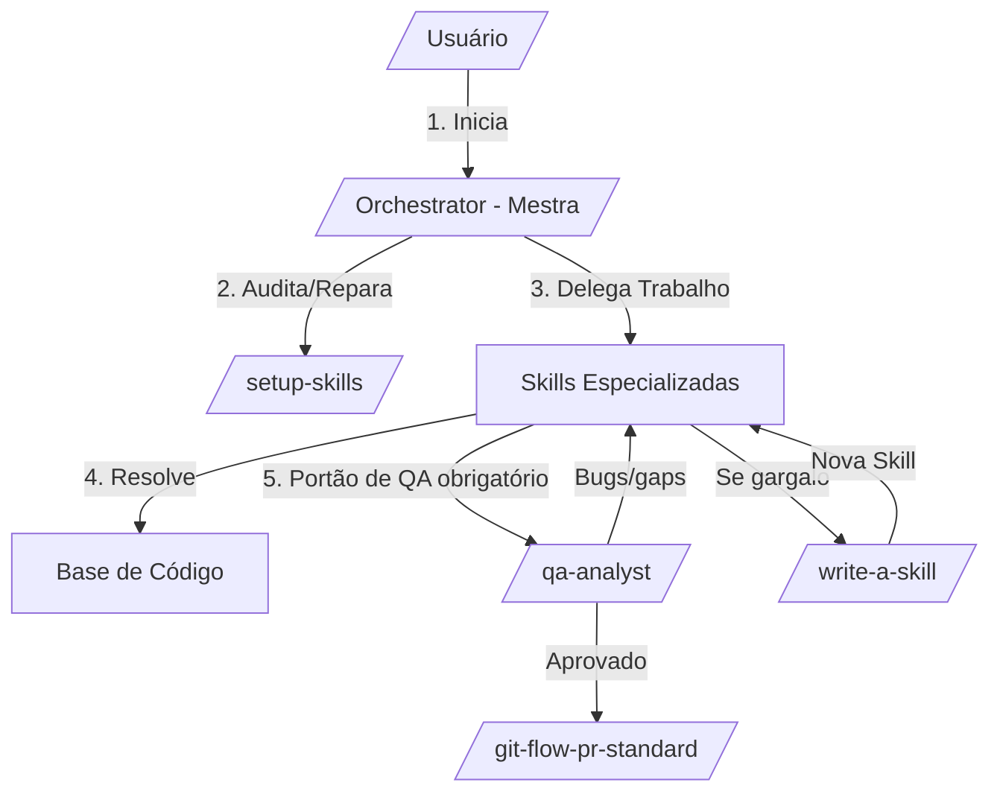

# Governança de Skills

Skills são organizadas em pastas de buckets sob `skills/`:

- `engineering/` — trabalho diário de código
- `productivity/` — ferramentas para workflow não relacionadas a código
- `misc/` — mantidas mas raramente usadas
- `personal/` — vinculadas ao setup pessoal, não promovidas
- `in-progress/` — rascunhos não prontos para distribuição
- `deprecated/` — não utilizadas

Toda skill em `engineering/`, `productivity/` ou `misc/` deve ter referência no `README.md` raiz e entrada em `.claude-plugin/plugin.json`. Skills em `personal/`, `in-progress/` e `deprecated/` não devem aparecer em ambos.

## Protocolo de Agentic Workflow (/orchestrator)

Este repositório utiliza um modelo de delegação hierárquica focado em conformidade:

1. **Entrada**: `/orchestrator` audita o ambiente (fases 1-4).
2. **Delegação**: O `orchestrator` atua como Arquiteto (não executa código pesado).
3. **Execução**: Delega para skills especializadas (`diagnose`, `tdd`, etc.).
4. **Portão de QA (mandatório)**: ao final de todo desenvolvimento — para qualquer Tier de risco, sem exceção — o `orchestrator` **deve** invocar obrigatoriamente a skill `/qa-analyst` para analisar o código gerado/alterado antes de abrir o PR. Bugs ou gaps encontrados reabrem a DAG como novas tarefas; só após a análise de QA aprovar é que o `/git-flow-pr-standard` pode ser acionado.
5. **Expansão**: Gargalos não mapeados → invocação automática do `/write-a-skill`.

## Arquitetura do Sistema

