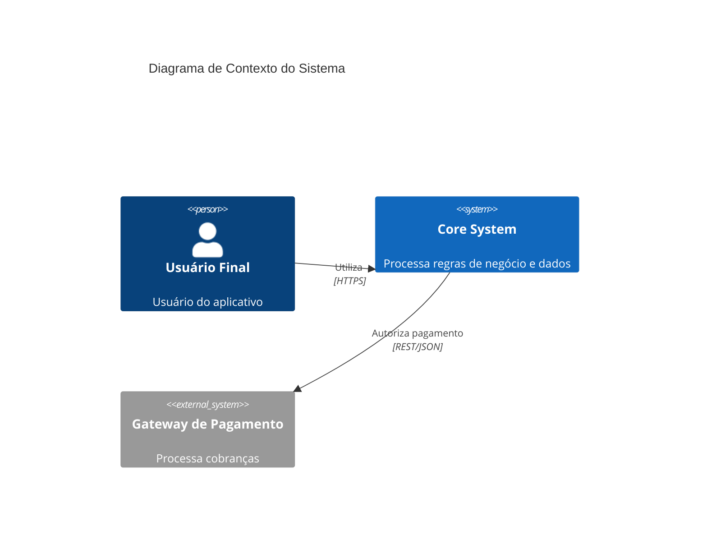
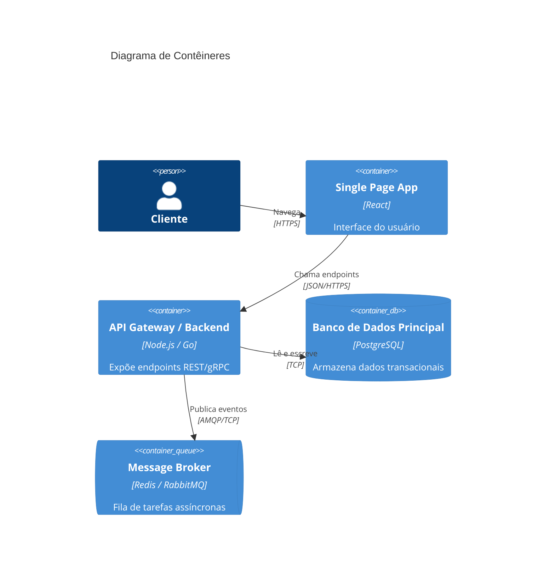

# Template: Architecture Design Document (ADD / SAD)

Use este template para criar o documento mestre em `docs/architecture/ADD.md`.

```markdown
# Architecture Design Document (ADD) - [Nome do Projeto]

## 1. Visão Geral e Contexto de Negócio
- **Objetivo:** O que este sistema resolve e qual valor entrega ao negócio.
- **Escopo do Projeto:** Limites do sistema, personas de usuários e fluxos críticos.
- **Stakeholders:** Equipes envolvidas, clientes e sistemas consumidores.

## 2. Requisitos Não Funcionais (NFRs) e Restrições
- **Escalabilidade e Carga:** Ex: suportar até 5.000 RPS com p95 < 200ms.
- **Disponibilidade:** Ex: 99.9% de uptime com failover multi-AZ.
- **Segurança & Compliance:** LGPD/GDPR, encriptação at-rest/in-transit, auditoria e RBAC.
- **Custos/FinOps:** Restrições orçamentárias de infraestrutura em nuvem.

## 3. Padrões e Estilo Arquitetural
- **Padrão Principal:** (Ex: Clean Architecture, Modular Monolith, Event-Driven, Microservices).
- **Justificativa:** Por que este padrão atende melhor aos NFRs do que as alternativas.
- **Convenções de Código:** Estrutura de pastas, camadas e limites de responsabilidade.

## 4. Visão de Arquitetura (C4 Model)

### 4.1 C4 Nível 1 - Diagrama de Contexto


### 4.2 C4 Nível 2 - Diagrama de Contêineres


## 5. Estratégia de Dados e Persistência
- **Bancos de Dados Primários:** Tecnologias selecionadas e modelo de dados.
- **Isolamento Multitenant:** Estratégia (ex: Row-Level Security vs Database per Tenant).
- **Consistência:** Modelo ACID para transações críticas e Eventual Consistency para leitura/relatórios.
- **Estratégia de Cache:** Políticas de TTL, invalidação e tecnologias (ex: Redis).

## 6. Comunicação, APIs e Integrações
- **APIs Públicas/Privadas:** REST (OpenAPI 3.0), gRPC ou GraphQL.
- **Mensageria Assíncrona:** Tópicos, dead-letter queues (DLQ), idempotência e retry policies.
- **Segurança de APIs:** OAuth2, JWT Bearer tokens, API Keys, Rate Limiting.

## 7. Infraestrutura e Implantação
- **Cloud Provider:** AWS / GCP / Azure / On-Premise.
- **Topologia de Rede:** VPC, subnets públicas/privadas, Load Balancer, Cloudflare/WAF.
- **Estratégia de Deploy:** Containers Docker, orquestração (Kubernetes / ECS / Fly.io), Blue/Green deploy.
- **CI/CD:** Pipelines de teste automatizado, análise estática e deploy contínuo.

## 8. Observabilidade e Operações
- **Logs Estruturados:** Formato JSON com `correlation_id` / `trace_id` propagado.
- **Métricas & Dashboards:** Prometheus / Datadog / Grafana (Golden Signals: Latência, Tráfego, Erros, Saturação).
- **Tracing Distribuído:** OpenTelemetry.
- **Alertas:** Canais de notificação para incidentes críticos.

## 9. Riscos e Débitos Técnicos Antecipados
- Riscos arquiteturais conhecidos e planos de mitigação.
```
