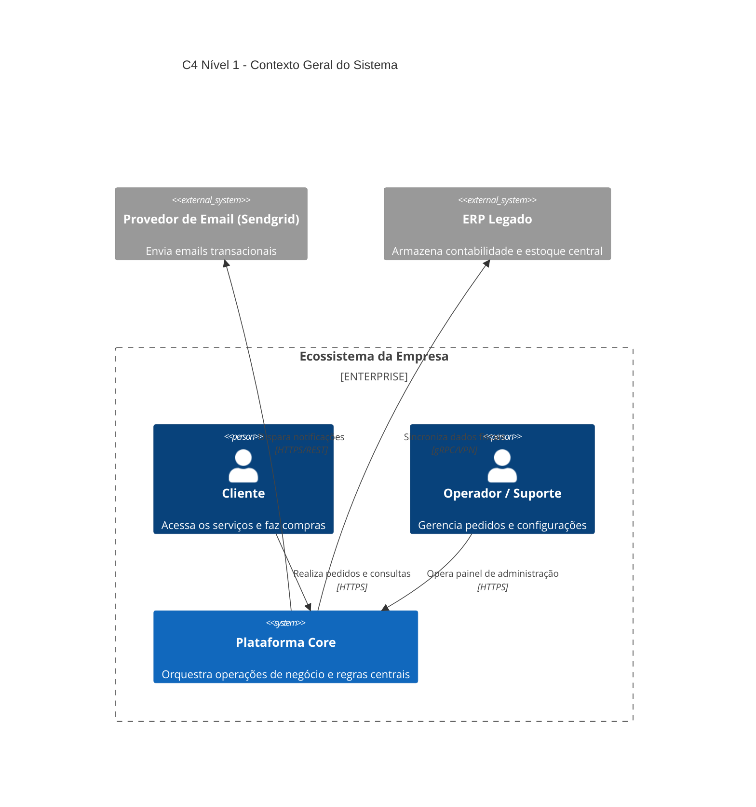
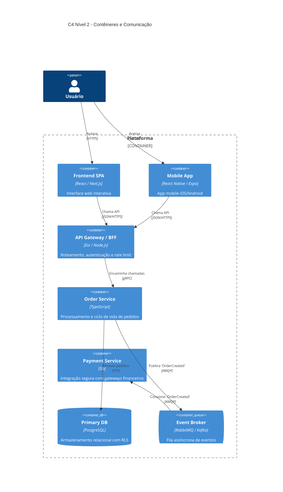
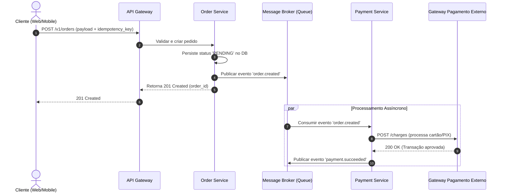
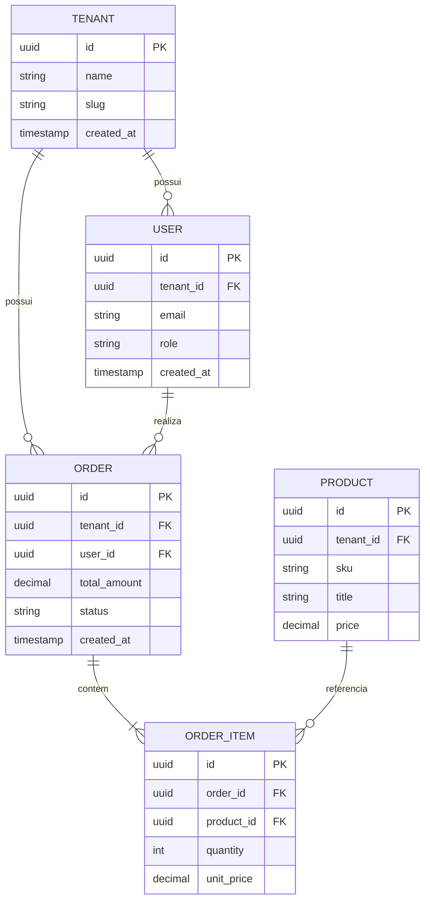

# Referência de Diagramas: C4 Model, Sequência e DER

Use diagramas Mermaid em todos os documentos arquiteturais para garantir renderização nativa em Markdown no GitHub/GitLab e documentações de código.

---

## 1. C4 Model (Contexto e Contêineres)

### C4 Nível 1 - Contexto do Sistema
Ilustra os limites do sistema, seus usuários e sistemas externos.

---

### C4 Nível 2 - Contêineres
Expõe as aplicações, bancos de dados, microsserviços e mensageria.

---

## 2. Diagrama de Sequência (Fluxos e Protocolos)

Essencial para explicitar chamadas síncronas, assíncronas, webhooks e idempotência.

---

## 3. Diagrama de Entidade-Relacionamento (DER / Esquema de Dados)

